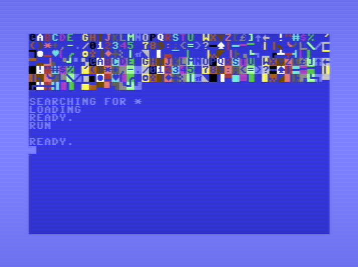

# C64 Examples ⌨️

This repository contains a collection of C64 assembly programettes / snippets that demonstrate different behaviors in the C64 architecture. This repository can be a useful resource for learning C64 programming (through Kick Assembler). 


```
IMPORTANT: this project is for educational purposes. You can compile and run, 
modify and do whatever you like with the example code.

The code can be assembled with Kick Assembler https://theweb.dk/KickAssembler but if you only want to test,
I included the .prg executable files that you can insert into an emulator or write to cassettes, 
floppies or whatever that makes you happy :)
```
## Learning path
1) 💡 [1_border_color](./01_border_color/) - setting the border color is very easy and equally rewarding. You can do something flashy, with a short bit of code to modify the outlook of your target machine. **You can start to understand the process from here.** You can check out the `/all_colors` directory below to learn more.

2) 💡 [2_constants_and_variables](./02_constants_and_variables/) one of the most important parts of any programming language. Simple and easy concept to grasp, and important to master.

3) 💡 [3_basic_arithmetic_registers](./03_basic_arithmetic_registers/) there are 3 registers (there are two + 1 more later)
 in the MOS 6502 / 6510 CPU 'A' and two index registers 'X' and 'Y' here we learn about them.

4) 💡 [4_tables](./04_tables/) we already checked out variables so talbes are pretty simple to get some grasp on. They can work similarly to arrays in modern programming.

5) 💡 [5_hello_world](./05_hello_world/) the first complex program we write in this tutorial package. 
**This is complex, so don't get discouraged if it is hard at first** then it will be very satisfying when 
you understand how it works. Here, I've explained every step in comments, so hopefully you will get the hang 
of it with a little bit of playing around. I encourage trial and error ways of learning. 

6) 🏁 [FIRST_CHALLENGE](./06_FIRST_CHALLENGE/) we have learned enough, that you can start writing your own simple programs. 
I encourage that you write as many as you can, so you discover all the pitfalls and best practices of the concepts we have learned.
 

7) 💡 [7_basic_math_with_c64](./07_basic_math_with_c64/) we have learned about the 'A' 
register and hint about it's math capabilities so let's check out how it works. 
In this example we learn simple 8 bit addition and subtraction. Division
and multiplication is not built in to the CPU - so if you need something like 
that, you have to program it yourself. That's a great excersize after this
chapter (maybe a little bit too advanced, but if you feel adventureous you can
try a simple multiplier). 

8) 💡 [8_if_else_branching](./08_if_else_branching/) One of the most important aspect of every programming language is to be able to build a control flow
in this chapter we'll learn about the BEQ, BCC, BCS mnemonics (bsc opcodes) to be able to create branches on previous comparisons (CPX, CPY)

9) 💡 [9_screen_memory](./09_screen_memory/) We will see in this chapter (or example) that we can address every single cell (8px x 8px area) of the screen
from the address `$0400` we can start addressing each cell one by one, storing
a screen code - which represents a symbol (letter, number or some special character) -
and from the memory `$d800` we can use our favourite 16 colors in quite the
fun configurations, so we will be able to generate something like this, with
only just a few lines of assembly code. 

10) 💡 [10_keyboard_detection](./10_keyboard_detection/) detecting keyboard strokes is a
pretty important feature for any computer program - especially for a commodore 64 program. 
When we try to control our player in games, or select options in a program, we rely on the computer being able to capture our keyboard strokes runtime and use it
to compute some outcome (move a sprite on x or y axis or dispatch some event, or calculate with the keycode of the triggered key)

## Sources
`Here I list some sources you can use for learning`

- [C64 Instructions](https://c64os.com/post/6502instructions)
- [C64 Screen Codes](https://sta.c64.org/cbm64scr.html)
- [C64 Color Codes](https://sta.c64.org/cbm64col.html)
- [C64 Memory Map](https://sta.c64.org/cbm64mem.html)

## Credits

A useful resource from a very nice and smart guy on youtube who explains the concepts
in details. This example list is somewhat following his tutorials. 
I highly suggest his tutorials on the topic:

[▶️ C64 Assembly Programming Course](https://youtube.com/playlist?list=PLU1o_YShTPgoA7_nZ0PutqaPDsitA5RvV&si=jpkUdWcX8eb1PapG)

And also you can check out his channel [Commodore Tutorials](https://www.youtube.com/@board-b-tutorials/featured)